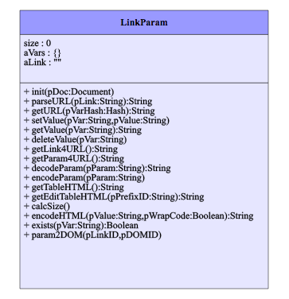

## Javascript Class: LinkParam
created Javascript Class Creator JSCC 2017/11/14 11:37:47

https://niebert.github.io/JavascriptClassCreator

**File:** `js/linkparam.js`

**Demo LinkParam:** https://niebert.github.io/LinkParam/index.html

The file `index.html` sends the values via the Link Parameter.

The demo works cross-origine. You can submit a parameter cross-origine to the file `receiver.html`. Copy `index.html` to your hard drive and press the submit button.

**Examples:**
* https://niebert.github.io/LinkParam/reveicer.html?myparam=TestValue
* https://niebert.github.io/LinkParam/reveicer.html?myparam=Test&count=460

## NPM installation
Installation with NPM and save the package to your dependencies (i.e. add entry `linkparam` as package in your `package.json`) with
`npm install linkparam --save`
Assume you will use this package in your NodeJS application `my_web_app` with the main file `index.js`. With the command above any other user, that installs your package `my_web_app` will install `linkparam` as well due to the dependency of `my_web_app` with the library `linkparam.js`. When you want to replace the package `linkparam` with another NPM package, edit your `package.json` and remove `linkparam` from the dependencies.   

## Javascript Class: `LinkParam`
created Javascript Class Creator JSCC 2017/12/27 9:30:40
https://niebert.github.io/JavascriptClassCreator
File: `js/linkparam.js`

### Attributes: `LinkParam`

#### size:Integer
* Default value: `0`
* Visibility: `public`
* Comment: Counts the Number of Parameter

#### aVars:Hash
* Default value: `{}`
* Visibility: `public`
* Comment: Attribute: 'aVars' Type: 'Hash' stores all URL parameters

#### aLink:String
* Default value: `""`
* Visibility: `public`
* Comment: Attribute: 'aLink' Type: 'String' stores the Link before '?'

### Methods: `LinkParam`

#### init(pDoc:Document)
* Visibility: `public`
init extract the link with parameters from document.location.search and store aLink)

#### parseURL(pLink:String):String
* Return Type: `String`
* Visibility: `public`
parses the URL stores the variables in 'aVar' e.g. ..&lastname=Niehaus&... stores aVars['name']='Niehaus')String

#### getURL(pVarHash:Hash):String
* Return Type: `String`
* Visibility: `public`
Comment for getLink)String

#### setValue(pVar:String,pValue:String)
* Visibility: `public`
Comment for setValue)

#### getValue(pVar:String):String
* Return Type: `String`
* Visibility: `public`
Comment for getValue(pVar) return the definition of the parameter exists otherwise en empty string)String

#### deleteValue(pVar:String)
* Visibility: `public`
Comment for deleteValue in the parameter hash aVars
return a Boolean if delete was sucessful, resp. variable pVar exists in Hash aVars)

#### getLink4URL():String
* Return Type: `String`
* Visibility: `public`
get the Link part of the URL without the URL parameters)String

#### getParam4URL():String
* Return Type: `String`
* Visibility: `public`
get the parameter string for the URL starting with ? if aVars contains variables)String

#### decodeParam(pParam:String):String
* Return Type: `String`
* Visibility: `public`
decode a parameter from the URL)String

#### encodeParam(pParam:String)
* Visibility: `public`
encode a parameter for a call from the app.)

#### getTableHTML():String
* Return Type: `String`
* Visibility: `public`
creates a HTML table with two column for key and value of the parameter hash aVars)String

#### getEditTableHTML(pPrefixID:String):String
* Return Type: `String`
* Visibility: `public`
creates a Edit HTML table with two column for key and value of the parameter hash aVars.
The keys of aVars are used as IDs for the HTML form.
An optional ID prefix as parameter can be used to create a unique ID for the DOM elements
All parameters are visible in an input field.)String

#### calcSize()
* Visibility: `public`
calculates the number of variables defined in the URL parameters, stores result in length)

#### encodeHTML(pValue:String,pWrapCode:Boolean):String
* Return Type: `String`
* Visibility: `public`
Encodes source code for HTML-Output in as code or textarea in the following way:
 1) Replace "&" character with "&amp;amp;"
 2) Replace "<" character with "&amp;lt;"
 3) Replace ">" character with "&amp;gt;"
The converted `pValue` will wrapped with `pre` and `code` tags for direct display as HTML
and without code tag wrapper if the code is written as inner HTML and value to a textarea.)
* Return: String

#### exists(pVar:String):Boolean
* Return Type: `Boolean`
* Visibility: `public`
checks if the parameter with variable 'pVar' exists in parameter hash this.aVars)Boolean
